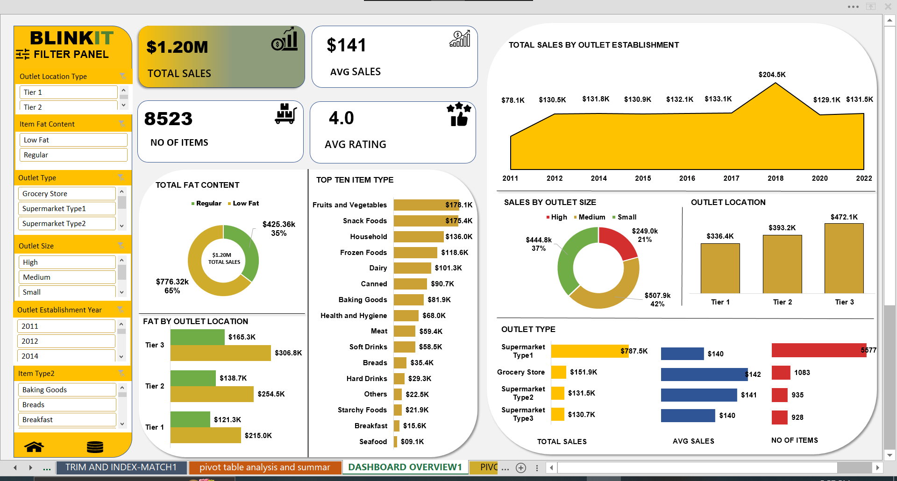
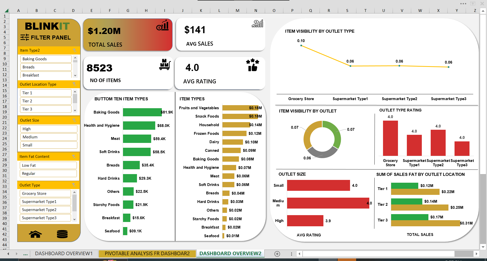

# 📊 Christabel Excel Dashboard – Blinkit Sales Analysis

An interactive Excel dashboard built in Microsoft Excel 2013 to analyze and visualize supermarket sales and outlet performance using charts, slicers, pivot tables, and macros.

## 🚀 Quick Overview

- Built in Excel 2013
- Combines pivot tables, slicers, charts, and light VBA macros for pivot table support and integrity checks
- Focused on analyzing sales data and outlet performance using a publicly available grocery dataset from Kaggle (Blinkit)
- Includes 2 dashboards:
  - Dashboard 1: Sales KPIs, top 10 items, outlet summaries
  - Dashboard 2: Item visibility, bottom 10 items, outlet ratings

## 📂 How to Use

1. Download and open the Excel file:  
   👉 BlinkIT Grocery Data COPY.xlsm
2. Click “Enable Content” to allow macros to run
3. Use slicers and filters to interact with the dashboard and explore insights

## 📸 Screenshots

### 🔹 Dashboard 1
  
*Main sales dashboard with KPIs, top 10 item types, and outlet summaries*

### 🔹 Dashboard 2
  
*Deeper analysis with bottom 10 item types, item visibility, and outlet performance*

---

  
🔍 Click to see full project breakdown & thought process

## 🧠 Project Objective

To build a clean, professional Excel dashboard that allows for interactive sales analysis across outlet types, outlet sizes, item types, and visibility. Designed for fast decision-making and business reporting.

---

## 🧩 Dashboard Breakdown

### 🔹 Dashboard 1 – Sales Overview
- KPI cards showing key figures
- Total fat content (sales quantity)
- Fat by outlet location
- Top 10 item types
- Sales by outlet establishment type
- Sales by outlet size
- Outlet location and type summary

### 🔹 Dashboard 2 – Deep Dive
- Bottom 10 item types
- Item types breakdown
- Item visibility by outlet sizes and outlet type
- Outlet type ratings
- Outlet size charts
- Sum of sales fat by outlet location

---

## 🛠 Tools & Skills Used

- Microsoft Excel 2013
- Pivot Tables & Pivot Charts
- Slicers
- VBA Macros for automation
- Chart design & layout formatting

---

## 🌱 What I Learned

- Structuring dashboards for decision-makers
- Cleaning and organizing raw data for pivot analysis
- Visual storytelling through Excel
- Writing documentation for public GitHub projects

---

## 📄 Data Source

This dataset was obtained from Kaggle for learning and analysis purposes.  
All data used is publicly available and intended for educational projects.
